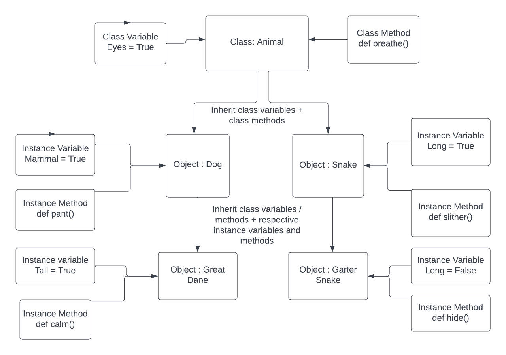

# OOP Four Pillars
Object orientated programming is a programming style which is focuses programming around objects and classes rather than functions and logic. OOP focuses on the objects in use rather than the logic required to manipulate them
# The 4 pillars of OOP - Abstraction
Abstraction aims to reduce complexity and isolate the impact of change. The idea of abstraction is the user only needs to be able to use the code, they don't need to know/ interact with the logic underlying it.
````python
class Animal:

    def __init__(self):
        self.alive = True
        self.spine = True
        self.eyes = True
        self.lungs = True

    def breathe(self):
        print("One breath in and one breath out")

    def eat(self):
        print("Nom Nom Nom")

    def procreate(self):
        print("Find a mate")

    def move(self):
        print("Onwards and Upwards")

cat = Animal()
cat.eat() # Output = Nom Nom Nom
````
* Here we have a `class` `Animal` and from it we have made the object `cat`.
* Abstraction is at play here because when we call the `cat` to eat, we don't have to write out the whole function, we only need to know to type `.eat`
* To achieve our goal, we do not need to know how to write the `method`, only how to use it which is the essence of `abstraction`

**Note - Abstraction isn't only implemented in OOP, simply using functions is an example of abstraction**

# Inheritance
Inheritance is concerned with eliminating redundant code, and this is achieved by allowing `classes` to `inherit` `class variables` and `class methods` from the base class:
* In order for a new `class` to inherit the base `classes`: features, the following syntax must be used:

```
from <file name> import <ClassName>

class NewClassName(OldClassName):
         def __init__(self):
         super().__init__()
```
* Following this code, the new class can be created as normal, and it will have access to the `base classes'` attributes:
````python
from animal import Animal

class Reptile(Animal):

    def __init__(self):
        super().__init__()
        self.cold_blooded = True
        self.tetrapod = None
        self.hear_chambers = [3, 4]
        self.amniotic_eggs = None
        self.venom = False

    def seek_heat(self):
        print("It's chilly outside, where is the sun?")

    def hunt(self):
        print("Wait, wait, wait....Pounce")

    def use_venom(self):
        print("If I have got it, I am going to use it")

    def attract_through_scent(self):
        print("Time to spray some eut de toilette")


jeremy_the_reptile = Reptile() 
jeremy_the_reptile.breathe()   # Output = One breath in and one breath out
jeremy_the_reptile.hunt()      # Output = Wait, wait, wait....Pounce
````
* As can be seen the `Animal class` is `imported`, which allows the new `class Reptile` to inherit the base attributes.
* The object `jeremy_the_reptile` which has been `instantiated` has access to the `class variables` and `class methods` of both `Animal` and `Reptile` 

# Encapsulation
The goal of encapsulation is to decrease complexity and hide as many of the inner workings of a program as possible, while still allowing the user to use the program.
* Encapsulation. This principle states that all important information is contained inside an object and only select information is exposed. The implementation and state of each object are privately held inside a defined class. Other objects do not have access to this class or the authority to make changes. They are only able to call a list of public functions or methods. This characteristic of data hiding provides greater program security and avoids unintended data corruption.
* An example of this can be seen in the `inheritance` section, as the user is able to `call` `methods` and `variables` from the Animal `class` however that `class` is in a different file and therefore cannot be accessed and edited by the user.

# Polymorphism
Under `polymorphism`, `objects` and `classes` have shared characteristics due to deriving them from base `classes` in a relational tree like way. Different objects/classes can also have different variations of the same `class variables` and `methods`:
````python
from reptile import Reptile

class Snake(Reptile):

    def __init__(self):
        super().__init__()
        self.forked_tongue = True
        self.venom = True
        self.limbs = False

    def use_tongue_to_smell(self):
        print("Do I say it smells or tastes nice?")
````
* In the above example, the `class` `Snake` is derived from `Reptile`, however they have different values for `self.venom` variable, with one being `True` and the other `False`
* Objects instantiated from `Reptile` will therefore have their venom set to `False`, while objects instantiated from `Snake` will show `True`, even though the latter is derived from the former.
* Under the principle of polymorphism, inherited class variables and methods in instance classes can be changed without affecting the class variables or methods for other objects.

## OOP Diagram
Below is a diagram which showcases the principles and pillars of OOP:



### Lambda functions
* `Lambda` functions are similar to user-defined functions but without a name. They're commonly referred to as `anonymous` functions
* `Lambda` functions are efficient whenever you want to create a function that will only contain simple expressions – that is, expressions that are usually a single line of a statement. They're also useful when you want to use the function once
* `Lambda` functions do not have a `return` keyword, as they automatically return the value
* `Lambda` functions follow the syntax `lambda <argument(s)>: <instructions>`
* `Lambda` functions are called by `immediately invoking` them
* For example : `(lambda x : x * 2) (3)`. The output of this would be 6, where the `x` is replaced with the argument `3` in the separate brackets
* Notice how the entire `lambda` function is in brackets

### Lambda use cases
* When you want to make a simple expressions : no loops or if blocks
* When you want to iterate through a data set using in-built functions
* In data science when creating a data frame from Pandas